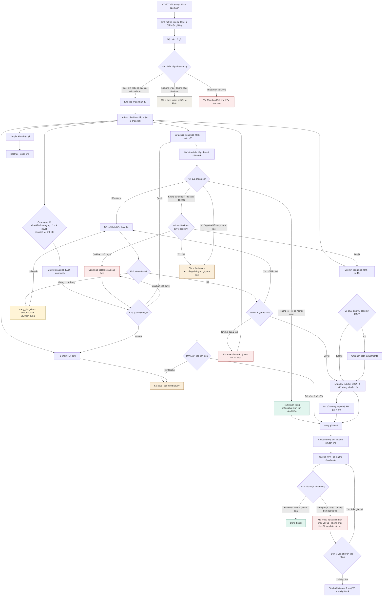

# Đánh giá & Hoàn thiện Luồng quy trình Bảo hành
### (Bản review của người thiết kế hệ thống — đối chiếu trực tiếp với dữ liệu vận hành thật)

**Tài liệu gốc tham chiếu:** `He-thong-quy-trinh-bao-hanh_Phan-tich-va-De-xuat.md`
**Dữ liệu đối chiếu:** `đơn_gửi_bảo_hành.xlsx` — 8 sheet, 239 dòng HANG VE KHO, 26 dòng DON BAO HANH, 24 dòng GUI BAO HANH, 17 dòng TRA BAO HANH (dữ liệu tính đến 13/08/2026).

---

## 1. Nhận định chung

Tài liệu gốc đúng hướng: tách trạng thái thành state machine + event log, chuẩn hóa dữ liệu, tách "kho tiếp nhận" thành luồng dùng chung, mã tra cứu kép QR/tay, không phụ thuộc MISA API chưa sẵn sàng — đây đều là các quyết định thiết kế hợp lý và tôi giữ nguyên toàn bộ.

Việc đối chiếu với dữ liệu thật cho thấy hai điều:

1. **Các vấn đề tài liệu nêu ở mục 2 là có thật và thậm chí nghiêm trọng hơn mô tả** — không chỉ "khó kiểm soát" mà một số cơ chế **chưa từng vận hành** trong thực tế (xem mục 2 dưới đây).
2. **Luồng to-be (mục 6 của tài liệu gốc) còn thiếu khoảng 3 nhóm nhánh nghiệp vụ** đang tồn tại thật trong dữ liệu (`SETTINGS`) nhưng không xuất hiện trong sơ đồ mới — nếu build đúng theo sơ đồ đó, hệ thống mới sẽ *thiếu tính năng* so với quy trình thủ công hiện tại. Đây là phần tôi tập trung hoàn thiện.

---

## 2. Đối chiếu dữ liệu thật — phát hiện bổ sung

### 2.1. Trường liên kết Kho ↔ Đơn bảo hành: thiết kế có, nhưng **chưa bao giờ được dùng**

Sheet `HANG VE KHO` có cột **"Mã truy vấn (ID đơn gửi bảo hành nếu có)"** — đúng là trường được sinh ra để nối kho với đơn bảo hành. Kiểm tra thực tế:

| Trường | Tỷ lệ có dữ liệu |
|---|---|
| Mã truy vấn (ID đơn gửi bảo hành nếu có) | **0 / 239** |
| Đánh giá kiểm soát đầu vào | **0 / 239** |
| Mã PO tương ứng | **0 / 239** |

→ Đây không phải "khó đối chiếu" như tài liệu gốc mô tả ở mục 2.4 — mà là **liên kết chưa từng phát sinh dữ liệu**. Thay vào đó, nhân sự đang dùng cột tự do "Ghi chú xác nhận" để đánh dấu tay bằng câu **"Đã tạo đơn trên Appsheet BH" / "Chưa tạo đơn trên Appsheet BH"** — tức là dùng text tự do làm cờ trạng thái liên kết, vì cơ chế liên kết chính thức không ai dùng.

**Hệ quả cho thiết kế mới:** đây chính xác là lý do `lookup_code` (mục 4–5 tài liệu gốc) phải là **bắt buộc và tự động gắn ngay từ lúc tạo phiếu**, không được là trường tùy chọn nhập tay như hiện tại — nếu không, lịch sử sẽ lặp lại: nhân viên sẽ tiếp tục tự chế cờ trạng thái bằng ghi chú.

### 2.2. Bộ enum trong SETTINGS tự nó đã vi phạm nguyên tắc "một nguồn sự thật"

`TRẠNG THÁI ĐƠN BẢO HÀNH` và `TRẠNG THÁI GỬI TRẢ` **dùng chung một số giá trị** (`HÀNG TRỪ KHO`, `KTV NHẬN THÙNG`, `ADMIN ĐÃ ĐÓNG HÀNG XONG`...) — hai state machine khác nhau nhưng chia sẻ nhãn, dễ gây nhầm khi lọc báo cáo. Ngoài ra tiêu đề cột `TÌNH TRẠNG BẢO HÀNH BẢO HÀNH` bị lặp chữ — dấu hiệu điển hình của sheet phình to theo thời gian, không ai dọn lại.

Nghiêm trọng hơn: giá trị **`Chưa tiếp nhận` và `chưa tiếp nhận`** cùng tồn tại như hai entry riêng trong danh mục enum (khác hoa/thường) → nếu convert thẳng sang dropdown AppSheet hiện tại, hai giá trị này được xem là khác nhau, làm sai lệch báo cáo đếm theo trạng thái ngay từ bây giờ, trước cả khi migrate.

**Khuyến nghị cụ thể:** khi chuẩn hóa `SETTINGS` thành bảng danh mục trong D1 (mục 5.3 tài liệu gốc), cần thêm bước **dọn & de-duplicate theo `LOWER(TRIM(value))`** trước khi seed, và ràng buộc UNIQUE theo (entity_type, state_code) chứ không theo text hiển thị.

### 2.3. Serial — nền tảng của "tra cứu tự động" trong thiết kế mới — hiện chỉ được ghi nhận ở khoảng 23% ticket

Cột `SERIAL` trong `DON BAO HANH` chỉ có dữ liệu ở 6/26 dòng (~23%); ngược lại `MODEL SẢN PHẨM` gần như luôn có (25/26), còn `MODEL NHẬP TAY` (cột dự phòng khi không tra được model) lại **0/26** — nghĩa là hiện tại KTV luôn chọn được model từ danh mục, nhưng phần lớn **không nhập serial** dù có ô cho phép.

Đây là rủi ro thật cho mục 5.4–5.5 của tài liệu gốc: thiết kế "tra Serial/Model từ Cloudflare D1 → tự động điền" giả định serial sẽ có sẵn hoặc được nhập, nhưng số liệu cho thấy đây là một **thói quen nhập liệu**, không chỉ vấn đề đồng bộ. Nếu không có cơ chế ép buộc (bắt buộc nhập hoặc quét mã), tính năng tra cứu bảo hành theo serial trong hệ thống mới sẽ có input rất thưa và giá trị thực tế thấp hơn kỳ vọng.

### 2.4. Cờ "Trùng ID / Trùng serial" — tồn tại trong schema nhưng 0% được set trong toàn bộ dữ liệu quan sát được, khớp đúng với nhận định 2.4 của tài liệu gốc — xác nhận đây là tính năng **có UI nhưng không có logic đứng sau**, cần thay bằng ràng buộc UNIQUE tự động ở tầng database thay vì checkbox thủ công.

---

## 3. Các nhánh nghiệp vụ có thật nhưng **bị thiếu trong sơ đồ to-be** (mục 6 tài liệu gốc)

Đối chiếu danh mục `PHƯƠNG ÁN XỬ LÝ` trong `SETTINGS` với sơ đồ to-be hiện có, có **3 nhóm nhánh đang vận hành thật** nhưng không được model:

| Giá trị thật trong SETTINGS | Có trong sơ đồ to-be? |
|---|---|
| Sửa chữa trong bảo hành / Đổi mới trong bảo hành | ✅ Có (F1/F2) |
| Trả lại KTV / Hủy đơn bảo hành | ✅ Có (F3) |
| **Hỗ trợ đổi mới bảo hành có phê duyệt** | ❌ Không có |
| **Hỗ trợ sửa chữa bảo hành có phê duyệt** | ❌ Không có |
| **Hỗ trợ trừ công nợ bảo hành có phê duyệt** | ❌ Không có |
| **Xác nhận linh kiện, trừ công nợ** | ❌ Không có |
| Sửa dịch vụ tính phí | ❌ Không có |

Tức là **gần một nửa danh mục phương án xử lý thật** (các case "ngoài chính sách chuẩn", cần quản lý phê duyệt hoặc phát sinh chi phí/trừ công nợ với KTV) hoàn toàn vắng mặt trong thiết kế mới. Nếu build đúng theo sơ đồ gốc, đội Admin bảo hành sẽ **không có chỗ để xử lý các case ngoại lệ này trên hệ thống mới** và buộc phải quay lại xử lý tay/ghi chú ngoài hệ thống — lặp lại đúng vấn đề mà dự án đang muốn giải quyết.

Ngoài ra, `NGUYÊN NHÂN CHẬM` cho thấy phần lớn lý do trễ tiến độ không nằm trong tầm kiểm soát vận hành nội bộ mà đến từ: *chờ kho xuất hàng, hết hàng tồn kho, chờ mail phê duyệt từ cấp quản lý, khách hàng chưa thanh toán, chờ thông tin từ bộ phận khác*. Sơ đồ to-be hiện tại không có trạng thái "tạm dừng chờ" (paused/blocked) tách biệt khỏi trạng thái đang xử lý bình thường — nghĩa là đồng hồ SLA (Giai đoạn 4 lộ trình) sẽ tính cả thời gian chờ ngoài tầm kiểm soát vào SLA nội bộ, khiến cảnh báo trễ hạn kêu liên tục và sớm bị đội vận hành bỏ qua (alert fatigue).

---

## 4. Hoàn thiện mô hình dữ liệu

Bổ sung vào mục 4/5.3 của tài liệu gốc — 2 thực thể còn thiếu để phủ được các nhánh ở mục 3:

```
approvals                    -- phê duyệt ngoại lệ (đổi mới/sửa chữa/trừ công nợ ngoài chính sách chuẩn)
  id, ticket_id (FK), loai_de_xuat ('doi_moi_co_pd' | 'sua_chua_co_pd' | 'tru_cong_no_co_pd'),
  nguoi_de_xuat, nguoi_duyet, trang_thai ('cho_duyet'|'da_duyet'|'tu_choi'),
  ngay_de_xuat, ngay_duyet, ghi_chu

debt_adjustments             -- ghi nhận trừ công nợ gắn với ticket, tách khỏi MISA (nội bộ ↔ KTV)
  id, ticket_id (FK), partner_id (FK partners), so_tien,
  loai ('tru_cong_no'|'hoan_cong_no'), trang_thai, ngay_ghi_nhan, nguoi_thuc_hien

-- bổ sung vào warranty_tickets:
  trang_thai_cho ('khong_cho'|'cho_linh_kien'|'cho_phe_duyet'|'cho_thanh_toan')
     -- tách riêng khỏi trạng_thái chính; khi != 'khong_cho', đồng hồ SLA tạm dừng
```

Việc tách `trang_thai_cho` riêng khỏi `trạng_thái` chính là điểm mấu chốt để SLA (Giai đoạn 4) đo đúng thời gian xử lý nội bộ, không lẫn thời gian chờ bên ngoài — tránh false alarm.

---

## 5. Sơ đồ to-be đã hoàn thiện

### 5.1. Nhánh "Sửa chữa" (F1) cần tách theo 4 kết quả chẩn đoán, không gộp thành 1 bước

Sơ đồ ban đầu coi F1 là một khối duy nhất ("gán NV sửa chữa → đề xuất linh kiện"). Thực tế dữ liệu cho thấy schema đã dự trù sẵn các trường cho một kết quả khác — `Ảnh bằng chứng trả xác`, `Ngày trả xác`, `PAXL với xác linh kiện` — tức là **"trả xác" (không sửa/đổi được, trả lại phần hỏng)** là một case có thật trong nghiệp vụ, dù trong 26 dòng quan sát chưa phát sinh case nào (schema có, dữ liệu mẫu hiện tại toàn "Đổi mới trong bảo hành"). Việc gộp chung F1 thành một bước sẽ khiến hệ thống mới **thiếu chính xác 3 trong 4 kết quả xử lý thật** mà NV sửa chữa gặp hằng ngày. Cần tách F1 thành bước "chẩn đoán trước", rồi rẽ 4 nhánh độc lập, mỗi nhánh có state và bộ trường dữ liệu riêng:

| Kết quả chẩn đoán | Có phát sinh linh kiện/MISA? | Có phát sinh chi phí/công nợ KTV? | Đi về đâu |
|---|---|---|---|
| **Không lỗi** (lỗi do người dùng/thao tác, máy hoạt động bình thường) | Không | Không (trừ khi có phí kiểm tra dịch vụ) | Trả nguyên trạng → đóng gói lô trả (K) |
| **Sửa được** | Có — đề xuất linh kiện thay thế | Không (đúng chính sách bảo hành) | Luồng hiện có: đề xuất → Admin duyệt → MISA → sửa xong |
| **Không sửa được, đề xuất đổi mới** | Không (không sửa) | Có thể — tùy chính sách đổi mới | Chuyển thành case đổi mới (F2), cần Admin duyệt riêng vì đây là ngoại lệ so với sửa chữa ban đầu |
| **Không sửa được, không đổi — trả xác** | Không | Có thể trừ công nợ nếu lỗi do KTV/người dùng gây hỏng không thể phục hồi | Ghi nhận trả xác (ảnh + ngày) → PAXL với xác: hủy tại chỗ hoặc trả kèm lô về KTV |

**Lưu ý thiết kế quan trọng:** case "Không sửa được, đề xuất đổi mới" **không được tự động chuyển sang F2** — vì đây là một thay đổi phương án xử lý *sau khi* đã chẩn đoán, khác với case KTV/Admin chọn đổi mới ngay từ đầu (F2 gốc). Nó cần một bước duyệt riêng của Admin bảo hành (không phải NV sửa chữa tự quyết), vì phát sinh chi phí đổi linh kiện mới thay vì sửa — đúng như bạn nêu: *"Admin bảo hành sẽ duyệt đồng ý đổi mới"* là một quyết định tách biệt, không mặc định.

Ngoài ra, khuyến nghị bổ sung 2 giá trị còn thiếu vào danh mục `PHƯƠNG ÁN XỬ LÝ` trong SETTINGS (hiện chưa có value nào đại diện đúng cho case này): **"Không phát hiện lỗi — trả nguyên trạng"** và **"Không sửa/đổi được — trả xác"**, để khi lên state machine mới có mã trạng thái tương ứng thay vì phải diễn giải qua ghi chú tự do như hiện tại.




### Những gì được sửa so với sơ đồ gốc

| Vấn đề trong sơ đồ gốc | Cách hoàn thiện |
|---|---|
| Thiếu 3 nhánh "có phê duyệt" + "trừ công nợ" | Thêm nhánh `F5 → approvals` và `debt_adjustments`, đúng với danh mục thật trong SETTINGS |
| Vòng lặp `H1 Từ chối → G1` không giới hạn | Thêm ngưỡng escalate sau 2 lần từ chối, tránh ticket kẹt vô hạn giữa NV và Admin |
| Không có trạng thái chờ linh kiện | Thêm `trang_thai_cho = cho_linh_kien`, tách khỏi SLA chính — giải quyết đúng nguyên nhân chậm phổ biến nhất trong dữ liệu thật |
| Case "không nhận được hàng trả" (P) đổ chung vào C1 (báo lệch SL lúc nhận vào kho) | Tách thành nhánh khiếu nại vận chuyển riêng (`CX`), vì đây là sự cố ở chặng trả hàng, không phải chặng kho nhận |
| Không có cơ chế chống chờ phê duyệt vô thời hạn | Thêm escalate khi quá hạn chờ duyệt |
| F1 (sửa chữa) gộp chung 1 khối, không phản ánh 4 kết quả chẩn đoán thật (không lỗi / sửa được / đổi mới do Admin duyệt riêng / trả xác) | Tách thành bước chẩn đoán (`G0 → DIAG`) rẽ 4 nhánh độc lập, mỗi nhánh có state và bộ trường dữ liệu riêng — khớp với các trường `Ảnh bằng chứng trả xác`, `Ngày trả xác`, `PAXL với xác linh kiện` vốn đã có trong schema hiện tại nhưng chưa được model hóa thành luồng |

---

## 6. Câu hỏi cần chốt với đội vận hành trước khi bắt đầu Giai đoạn 1

1. **Ngưỡng escalate**: từ chối đề xuất linh kiện bao nhiêu lần thì tự động đẩy lên quản lý? (sơ đồ trên tạm đặt 2 lần, cần đội Admin BH xác nhận số thực tế).
2. **Ai có quyền duyệt case "có phê duyệt"** (đổi mới/sửa chữa/trừ công nợ ngoài chính sách) — một cấp hay nhiều cấp tùy giá trị?
3. **`debt_adjustments` có cần đối soát ngược với MISA không**, hay chỉ là ghi nhận nội bộ giữa công ty và KTV/CTV (không qua kế toán)?
4. **Có bắt buộc nhập/quét serial tại thời điểm tạo ticket không** — nếu bắt buộc, cần xác nhận mọi loại sản phẩm đều có serial in sẵn để quét, tránh chặn luồng tạo ticket với hàng không có serial vật lý (lõi lọc, linh kiện rời...).
5. **Định nghĩa "thất lạc trên đường trả"**: sau bao lâu không xác nhận nhận hàng thì tự động coi là sự cố vận chuyển và mở khiếu nại?

---

## 7. Việc cần làm ngay ở Giai đoạn 1 (bổ sung vào lộ trình gốc)

Tài liệu gốc đã có lộ trình 6 giai đoạn hợp lý; bổ sung 2 việc cụ thể vào **Giai đoạn 1 — Chuẩn hóa dữ liệu nền**, dựa trên phát hiện ở mục 2:

- **De-duplicate danh mục SETTINGS** theo `LOWER(TRIM())` trước khi seed vào D1 (mục 2.2), đồng thời tách rõ enum theo từng entity, không dùng chung nhãn giữa `warranty_tickets.trang_thai` và `return_shipments` state.
- **Không migrate nguyên trạng cột "Mã truy vấn"** từ `HANG VE KHO` sang `intake_records` vì trường này thực tế trống 100% — cần xây quy tắc suy luận liên kết cho dữ liệu lịch sử (theo người gửi + thời gian gần nhất) thay vì kỳ vọng map 1-1 tự động.
