# Phân tích & �� xuất tái thiết kế Hệ thống quy trình Gửi – Sửa – Trả Bảo hành

**Phạm vi:** toàn bộ luồng từ khi KTV/CTV/Trạm tạo yêu cầu bảo hành đến khi hàng được sửa/đổi và trả lại, dựa trên dữ liệu thực tế trong file `đơn_gửi_bảo_hành.xlsx` (8 sheet, n�n tảng Google Sheets + AppSheet), đã cập nhật theo phản hồi thực tế vận hành.

---

## 1. Hệ thống hiện tại đang vận hành như thế nào

### 1.1. Các "bảng" (sheet) đang đóng vai trò như module nghiệp vụ

| Sheet | Vai trò thực tế | Vai trò nghiệp vụ tương ứng |
|---|---|---|
| **GUI BAO HANH** | KTV/CTV/Trạm khởi tạo phiếu gửi hàng | Tạo lô gửi (Shipment) |
| **HANG VE KHO** | Kho xác nhận nhận thùng hàng vật lý | Nhập kho (Goods Receipt) |
| **DON BAO HANH** | Chi tiết từng linh kiện/máy trong 1 lô — trạng thái xử lý, sửa chữa, đổi trả | Ticket bảo hành (Work Order) |
| **LK DE XUAT SUA CHUA** | NV sửa chữa đ� xuất linh kiện thay thế | Yêu cầu vật tư (Parts Request) |
| **DON MISA LK** | �ơn xuất kho linh kiện liên kết với MISA (kế toán) | Lệnh xuất kho / đối soát kế toán |
| **TRA BAO HANH** | �óng gói, xuất phiếu, gửi trả v� KTV | Lô hàng trả (Return Shipment) |
| **SETTINGS** | Danh mục trạng thái, phương án xử lý, nguyên nhân chậm | Master data / Enum |
| **Luồng quy trình** | Mô tả tay 4 bước tổng quát | Tài liệu quy trình hiện có |

### 1.2. Luồng "as-is"

```
1. KTV/CTV/Trạm tạo phiếu gửi (GUI BAO HANH)
      → có thể gộp nhi�u linh kiện/máy lỗi vào 1 lô, mỗi lỗi có 1 ID riêng (DON BAO HANH)
2. �i�u vận/Kho nhận thùng hàng (HANG VE KHO)
      → xác nhận vật lý đã tới kho (đối chiếu bằng mắt với danh sách KTV khai)
      → phân loại: Giao Admin BH / Giao KTV SCVP / Giao kế toán nhập kho / Tiêu hủy
3. Admin bảo hành tiếp nhận từ Kho (DON BAO HANH)
      → tách theo loại: linh kiện điện tử r�i / lõi l�c / nguyên máy, theo hãng/đối tác
4. Admin phân loại & xử lý — rẽ 4 nhánh:
      a) Gửi NV sửa chữa (SCVP) → tạo phiếu đặt linh kiện tiêu hao → gán NV
         → NV sửa xong, đ� xuất linh kiện (LK DE XUAT SUA CHUA) → Admin duyệt → tạo đơn MISA (DON MISA LK)
      b) �ồng ý đổi trả (linh kiện mới) → tạo phiếu trả (TRA BAO HANH)
      c) Từ chối bảo hành → tiêu hủy hoặc trả lại nguyên trạng cho KTV
      d) Giao cho kho (nhập kho lại)
5. �óng gói – Kế toán duyệt – Gửi trả KTV (TRA BAO HANH)
```

### 1.3. �iểm mạnh đang có

- �ã có **tách vai trò** rõ (KTV → Kho → Admin BH → NV sửa chữa → Kế toán → trả hàng) — đúng tinh thần một quy trình bảo hành chuẩn.
- �ã có **ID liên kết chuỗi** giữa các bước (ID thùng hàng ↔ ID gửi trả ↔ mã phiếu xuất MISA) giúp truy vết được, dù thủ công.
- �ã ghi nhận **ảnh hiện trạng** (thùng hàng, gửi xe, sau sửa chữa) — có yếu tố bằng chứng.
- Có bước gắn với **kế toán/MISA** để kiểm soát chi phí linh kiện — không tách r�i tài chính kh�i vận hành.

---

## 2. Những điểm yếu / rủi ro của hệ thống hiện tại

### 2.1. Trạng thái bị phân mảnh, không có nguồn sự thật duy nhất
Sheet `HANG VE KHO` có cùng lúc 4 cột trạng thái độc lập cho 1 dòng: *Trạng thái kho*, *Trạng thái Admin BH*, *Trạng thái kế toán*, *Trạng thái SCVP*. �ây là dấu hiệu **status được cập nhật thủ công song song ở nhi�u nơi**, rất dễ lệch nhau. Không có bảng lịch sử thay đổi trạng thái (audit trail).

### 2.2. Không có SLA/cảnh báo chủ động
Cột "Tốc độ" chỉ có 2 giá trị tĩnh "Dưới 24h / Quá 24h" gán **thủ công tại th�i điểm tạo**, không tự tính lại theo th�i gian thực, không cảnh báo trước khi trễ.

### 2.3. Dữ liệu tự do (free text) ở những chỗ cần cấu trúc
Cột ghi chú vừa chứa trạng thái vừa chứa ghi chú tự do; nhi�u mã (vận đơn, tem linh kiện, phiếu xuất kho) bị gộp chung 1 ô, cách nhau bằng dấu `;` → không tách được để đối soát. Trư�ng "MODEL NHẬP TAY" tồn tại song song với "MODEL SẢN PHẨM" cho thấy nhi�u trư�ng hợp phải gõ tay vì không tra được model từ hệ thống.

### 2.4. Không kiểm soát khớp số lượng tự động
Số lượng KTV khai khi gửi và số lượng Kho xác nhận nhận không có cơ chế đối chiếu tự động — chỉ có các c� thủ công "Trùng ID", "Trùng serial" phần lớn đang b� trống.

### 2.5. �� xuất sửa chữa và xuất kho bị nối bằng tay
`LK DE XUAT SUA CHUA` chỉ nối với `DON MISA LK` qua việc nhập tay mã đơn MISA vào từng dòng — không có ràng buộc tự động 1-nhi�u.

### 2.6. Không có cổng tra cứu cho KTV/CTV
KTV không có cách tự tra tiến độ đơn của mình theo th�i gian thực.

### 2.7. Giới hạn n�n tảng bảng tính
Toàn bộ vận hành trên Google Sheets/AppSheet dạng bảng phẳng, nhi�u cột luôn rỗng — dấu hiệu schema phình to theo th�i gian, khó mở rộng báo cáo/BI, khó phân quy�n chi tiết.

### 2.8. Thông báo phụ thuộc email tĩnh
M»—i dòng lÆ°u cứng "EMAIL ADMIN", "EMAIL KTV", "EMAIL TN" thay vì hệ thống thông báo theo sá»± kiện.

---

## 3. Nguyên tắc thiết kế hệ thống mới (đã cập nhật theo thực tế vận hành)

1. **Một nguồn sự thật cho trạng thái** — mỗi ticket bảo hành chỉ có **một** trư�ng trạng thái chính (state machine), m�i thay đổi ghi vào bảng lịch sử (event log), không sửa đè.
2. **Chuẩn hóa dữ liệu, tách bảng theo thực thể** — không gộp nhi�u thực thể vào một bảng phẳng nhi�u cột.
3. **�iểm tiếp nhận của kho phải dùng chung được cho nhi�u loại đơn, không chỉ riêng bảo hành.** Bảo hành chỉ là **một loại nguồn hàng (source type)** đi vào cùng một luồng tiếp nhận của kho — kho cần sẵn sàng tiếp nhận cho các hệ thống/nhu cầu khác (hàng đổi trả bán hàng, hàng chuyển kho nội bộ...) mà không phải xây luồng riêng từng lần.
4. **Mã định danh linh hoạt, không phụ thuộc khả năng in ấn.** Hệ thống luôn sinh một mã định danh dạng chuỗi ngắn, dễ đ�c, cho mỗi lô gửi/ticket. Ngư�i dùng có 2 lựa ch�n ngang hàng: **in mã QR** (nếu có máy in) hoặc **ghi mã bằng tay** lên thùng hàng. Kho có ô nhập mã thủ công để tra cứu và xử lý đơn khi không quét được QR — quét và gõ tay là hai đư�ng vào cùng một dữ liệu, không đư�ng nào là bắt buộc.
5. **Không phụ thuộc vào tích hợp chưa sẵn sàng.** MISA hiện đang hoạt động độc lập, chưa có kết nối API. Vì vậy bước liên kết �� xuất linh kiện ↔ Lệnh xuất kho **tiếp tục nhập mã đơn MISA thủ công như hiện tại**; đây được thiết kế như một trư�ng dữ liệu chuẩn hóa (không còn bị gộp nhi�u mã trong 1 ô) để khi nào MISA có API thì chỉ cần nối thêm, không phải đổi mô hình dữ liệu.
6. **Tự động hóa đối chiếu số lượng & th�i gian** ở những khâu không phụ thuộc hệ thống ngoài.
7. **Truy vết bằng mã tra cứu** ở m�i điểm bàn giao vật lý (QR hoặc mã tay), thay vì xác nhận bằng mắt.
8. **Minh bạch hai chi�u** — KTV/CTV có cổng tra cứu trạng thái đơn của chính mình theo th�i gian thực, dùng chính mã định danh đã có.
9. **Thông báo theo sự kiện, đa kênh** — trigger tự động khi trạng thái đổi, không phụ thuộc cột email tĩnh.
10. **Triển khai trên n�n tảng có khả năng mở rộng thực sự** — không tiếp tục phình bảng tính, mà xây dựng một hệ cơ sở dữ liệu quan hệ, đứng trước AppSheet/Google Sheets như lớp đồng bộ dữ liệu (xem mục 5).

---

## 4. Mô hình dữ liệu đ� xuất (thực thể & quan hệ)

```
�ối tác/KTV (Partner)
   └─< Lô gửi (Shipment) — có thể chứa nhi�u loại đơn, không chỉ bảo hành
          ├─ loại nguồn (source_type): "Bảo hành" | "Khác"
          ├─ mã tra cứu (lookup_code) — sinh tự động, in QR HOẶC ghi tay
          └─< Bản ghi tiếp nhận tại kho (Intake Record)   [dùng chung cho m�i loại nguồn]
                 └─< Ticket bảo hành (Ticket)              [chỉ sinh khi source_type = Bảo hành]
                        ├─ Lịch sử trạng thái (Status History)     [event log, không đè]
                        ├─< Yêu cầu linh kiện (Parts Request)      [khi sửa chữa]
                        │      └─ Mã đơn MISA (nhập tay, 1 mã/1 dòng — không gộp)
                        └─ Lô hàng trả (Return Shipment)           [gói trả v� KTV]

Danh mục dùng chung (Master Data — đồng bộ 3h/lần từ hệ thống ID sẵn có, xem mục 5):
   - Sản phẩm & Serial (Model, hãng, nhóm sản phẩm, ngày SX, ngày mua, hạn bảo hành, lịch sử bảo hành)
   - Linh kiện (mã, tên)
   - Nhân sự & vai trò (KTV, Kho, Admin BH, NV sửa chữa SCVP, Kế toán)
   - Danh mục trạng thái / phương án xử lý (đã có sẵn ở sheet SETTINGS — giữ lại, chuẩn hóa thêm)
```

**Khác biệt cốt lõi so với hiện tại:**
- Bước "kho tiếp nhận" tách kh�i bảo hành thành một luồng chung (Intake Record) — ticket bảo hành chỉ là kết quả sinh ra **sau khi** biết bản ghi tiếp nhận đó thuộc loại "Bảo hành".
- Mỗi ticket có **một** trư�ng `trạng_thái` duy nhất theo state machine, thay vì 4 cột trạng thái r�i rạc theo từng phòng ban.
- Mã đơn MISA là một trư�ng chuẩn hóa riêng (1 giá trị/1 dòng liên kết), không còn bị gộp nhi�u mã cách nhau bằng dấu `;`.

---

## 5. �� xuất công nghệ triển khai — hệ thống web trên Cloudflare

### 5.1. Bối cảnh & mục tiêu

Sẽ triển khai một hệ thống web trên n�n **Cloudflare**, đóng vai trò là **lớp quản lý ID đơn bảo hành trung tâm**: lưu lịch sử, thông tin serial, mã ID, model, sản phẩm — sẵn sàng để tra cứu và sử dụng ngay khi tạo ticket mới (không phải gõ tay).

### 5.2. Kiến trúc đ� xuất trên Cloudflare

| Thành phần | Vai trò |
|---|---|
| **Cloudflare Workers** | Lớp API trung tâm: tra cứu ID/serial/model, ghi nhận sự kiện trạng thái, phục vụ cổng tra cứu cho KTV |
| **Cloudflare D1** (SQLite tại edge) | Cơ sở dữ liệu quan hệ chính: sản phẩm, serial, ticket, lịch sử trạng thái, đối tác |
| **google drive** | Lưu trữ ảnh (ảnh thùng hàng, ảnh gửi xe, ảnh sau sửa chữa...) thay vì để trong thư mục gắn với Sheet |
| **Cloudflare KV** | Cache tra cứu nhanh cho các giá trị đ�c nhi�u, ít đổi (danh mục model, trạng thái, đối tác) |

### 5.3. Thiết kế database (D1) đáp ứng nhu cầu thực tế

```
products                -- danh mục sản phẩm/model
  id, model_code, model_name, brand, product_group

serials                 -- gắn với 1 sản phẩm cụ thể đã bán ra
  id, serial_no (unique), product_id (FK products),
  manufacture_date, purchase_date, warranty_expire_date,
  last_synced_at

partners                -- KTV / CTV / Trạm
  id, partner_code, name, region, phone, email, active

lookup_codes             -- mã định danh dùng chung cho QR hoặc ghi tay
  id, code (unique, ngắn, dễ đ�c/gõ tay), entity_type ('shipment' | 'ticket'),
  entity_id, created_at, created_by

intake_records            -- điểm tiếp nhận CHUNG của kho, không riêng bảo hành
  id, lookup_code_id (FK), source_type ('bao_hanh' | 'khac'),
  so_luong_khai, so_luong_thuc_nhan, trang_thai_doi_chieu,
  nguoi_nhan, thoi_gian_nhan, ghi_chu

warranty_tickets          -- chỉ tồn tại khi intake_record.source_type = 'bao_hanh'
  id, intake_record_id (FK), serial_id (FK serials, có thể null nếu nhập tay),
  model_nhap_tay, hang, tinh_trang_hu_hong,
  trang_thai (state machine, 1 giá trị duy nhất), khu_vuc,
  nguoi_gui, nguoi_sua, phuong_an_xu_ly

status_history             -- event log, insert-only
  id, ticket_id (FK), tu_trang_thai, den_trang_thai,
  thoi_gian, nguoi_thuc_hien, ghi_chu

parts_requests              -- đ� xuất linh kiện của NV sửa chữa
  id, ticket_id (FK), ma_linh_kien, so_luong, ngay_de_xuat,
  ma_don_misa (nhập tay, 1 giá trị duy nhất/dòng), trang_thai_duyet

return_shipments             -- lô hàng trả v� KTV
  id, ticket_id (FK), lookup_code_id (FK), ma_van_don,
  ngay_dong_goi, ngay_ke_toan_duyet, ngay_gui, ngay_ktv_nhan

sync_log                     -- theo dõi mỗi lần đồng bộ 3h
  id, bat_dau_luc, ket_thuc_luc, so_dong_them_moi,
  so_dong_cap_nhat, trang_thai, loi_neu_co
```

**Vì sao tách `intake_records` kh�i `warranty_tickets`:** đây chính là điểm sửa theo yêu cầu — kho cần một luồng tiếp nhận dùng chung cho nhi�u hệ thống, không riêng bảo hành. `intake_records` không biết và không cần biết gì v� nghiệp vụ bảo hành; nó chỉ trả l�i "đã nhận đủ hàng theo mã tra cứu này chưa". `warranty_tickets` là một hệ quả nghiệp vụ được tạo ra sau đó, dựa trên `source_type`.

### 5.4. Dữ liệu data base ID sự cố có sẵn trên cloudflare

1. Hệ thống gửi bảo hành sẽ là hệ thông modul gắn với 1 hệ thống cloudflare có sẵn đang hoạt động, các thông tin ID sự cố đã có sẵn, chỉ cần xây dựng luồng xử lý bảo hành tích hợp thêm,

### 5.5. Mã QR / mã tay hoạt động cụ thể ra sao trong hệ thống mới

- Khi KTV tạo ticket, hệ thống luôn sinh 1 `lookup_code` — một chuỗi ngắn, dễ đ�c (ví dụ dạng `BH-XXXXX`), không phụ thuộc việc có in được QR hay không.
- Màn hình xác nhận cho KTV 2 lựa ch�n ngang hàng: **"In mã QR"** (nếu có máy in nhãn/máy in tại trạm) hoặc **"Ghi mã tay lên thùng"** (dùng đúng chuỗi `lookup_code` viết bằng bút lên thùng/nhãn dán).
- Tại kho, màn hình tiếp nhận có 2 cách nhập tương đương: **quét QR** hoặc **gõ tay mã** vào ô tìm kiếm để tự động kéo ra đúng đơn cần xử lý — không có luồng nào bị chặn nếu thiếu QR.

---

## 6. Luồng quy trình mới (to-be) — đã cập nhật

```mermaid
flowchart TD
    A[KTV/CTV/Trạm tạo Ticket bảo hành] --> A1[Sinh mã tra cứu: in QR hoặc ghi tay]
    A1 --> B[Gộp vào Lô gửi]
    B --> C{Kho: điểm tiếp nhận chung}
    C -->|Quét QR hoặc gõ tay mã, đối chiếu SL| D[Kho xác nhận nhận đủ]
    C -->|Lô hàng khác - không phải bảo hành| C2[Xử lý theo luồng nghiệp vụ khác]
    C -->|Thiếu/lệch số lượng| C1[Tự động báo lệch cho KTV + Admin]
    D --> E[Admin bảo hành tiếp nhận & phân loại]
    E --> F1[Sửa chữa: gán NV SCVP]
    E --> F2[�ổi mới: xuất kho linh kiện mới]
    E --> F3[Từ chối: tiêu hủy / trả nguyên trạng]
    E --> F4[Chuyển kho: nhập kho lại]

    F1 --> G1[NV sửa chữa nhận việc, đ� xuất linh kiện]
    G1 --> H1{Admin duyệt đ� xuất}
    H1 -->|Duyệt| I1[Nhập tay mã đơn MISA - 1 mã/1 dòng, chuẩn hóa]
    H1 -->|Từ chối| G1
    I1 --> J[NV sửa xong, cập nhật kết quả + ảnh]

    F2 --> I1
    J --> K[�óng gói lô trả]
    I1 --> K
    F4 --> L[Kết thúc - nhập kho]
    F3 --> M[Kết thúc - tiêu hủy/trả KTV]

    K --> N[Kế toán duyệt đối soát chi phí/tồn kho]
    N --> O[Gửi trả KTV - có mã tra cứu/vận đơn]
    O --> P{KTV xác nhận nhận hàng}
    P -->|Xác nhận + đánh giá kết quả| Q[�óng Ticket]
    P -->|Không nhận được| C1

    style A fill:#EEEDFE,stroke:#534AB7
    style Q fill:#E1F5EE,stroke:#0F6E56
    style C1 fill:#FCEBEB,stroke:#A32D2D
    style C2 fill:#F1EFE8,stroke:#5F5E5A
    style M fill:#FAEEDA,stroke:#854F0B
```



### Bảng diễn giải cập nhật

| Bước | Hiện tại | �� xuất mới (đã đi�u chỉnh) |
|---|---|---|
| Tạo ticket | Nhập tay model nếu không tìm thấy | Tra cứu Serial/Model từ database Cloudflare (đồng bộ 3h/lần) → tự động đi�n; vẫn cho nhập tay khi serial mới chưa kịp đồng bộ |
| Mã định danh | Ghi mã vận đơn thủ công, nhi�u định dạng | Hệ thống luôn sinh mã tra cứu; **KTV ch�n in QR hoặc ghi tay** — không bắt buộc in |
| Kho nhận | Xác nhận bằng mắt, chỉ dành cho hàng bảo hành | **�iểm tiếp nhận chung của kho**, nhận nhi�u loại nguồn hàng; quét QR hoặc gõ tay mã để tra cứu và đối chiếu số lượng tự động |
| Trạng thái | 4 cột trạng thái độc lập theo phòng ban | 1 trư�ng trạng thái theo state machine + bảng lịch sử (event log) |
| SLA | Gắn nhãn tĩnh "Dưới/Quá 24h" lúc tạo | �ồng hồ SLA tính real-time theo từng khâu, tự cảnh báo trước hạn |
| �� xuất linh kiện → xuất kho | Nối bằng tay qua mã đơn MISA, đôi khi gộp nhi�u mã 1 ô | **Vẫn nhập tay như hiện tại** (MISA chưa có API), nhưng chuẩn hóa 1 mã/1 dòng để dễ đối soát và sẵn sàng nối API sau này |
| Trả hàng | Theo dõi qua sheet riêng | Là bước cuối của cùng 1 Ticket, tự sinh khi các nhánh xử lý hoàn tất |
| Master data serial/model | Tra cứu thủ công hoặc gõ tay | tra cứu trực tiếp từ hệ thống ID hiện có lên Cloudflare D1, sẵn sàng tra cứu ngay khi tạo ticket |
| Thông báo | Cột email tĩnh trong từng dòng | Thông báo tự động đa kênh theo sự kiện đổi trạng thái |
| Tra cứu | KTV không có cổng riêng | Cổng tra cứu real-time cho KTV bằng chính mã tra cứu đã có |

---

## 7. Lộ trình triển khai đ� xuất (theo giai đoạn)

1. **Giai đoạn 1 — Chuẩn hóa dữ liệu n�n**: tách 4 cột trạng thái r�i rạc thành 1 trư�ng trạng thái + bảng lịch sử; chuẩn hóa cột đa giá trị (mã vận đơn, mã đơn MISA) thành 1 giá trị/1 dòng; tách "kho tiếp nhận" thành luồng chung, không gắn cứng vào bảo hành.
2. **Giai đoạn 2 — Dựng hệ thống Cloudflare (Workers + D1 + drive)**
3. **Giai đoạn 3 — Mã tra cứu kép (QR/ghi tay)** tại điểm tạo ticket và điểm kho tiếp nhận, đối chiếu số lượng tự động dựa trên `intake_records`.
4. **Giai đoạn 4 — SLA tự động & cảnh báo**: thêm mốc th�i gian từng bước, tự tính cảnh báo trễ.
5. **Giai đoạn 5 — Cổng tra cứu cho KTV/CTV** dùng mã tra cứu sẵn có + dashboard vận hành cho quản lý.
6. **Giai đoạn 6 (khi MISA sẵn sàng API)** — nối tự động �� xuất linh kiện ↔ Lệnh xuất kho; đến lúc đó chỉ cần thay lớp ghi nhận, không phải đổi mô hình dữ liệu vì đã chuẩn hóa từ Giai đoạn 1.

---

## 8. Bộ chỉ số theo dõi hiệu quả (KPI) cho hệ thống mới

- Th�i gian xử lý trung bình theo từng khâu (gửi → kho nhận → Admin xử lý → sửa chữa → trả hàng).
- Tỷ lệ đơn vượt SLA theo khâu, theo khu vực/CTV.
- Tỷ lệ lệch số lượng giữa khai báo và thực nhận tại kho (theo cả đơn bảo hành lẫn nguồn khác).
- Tỷ lệ ticket phải sửa lại lần 2 sau khi "đã sửa xong".
- Top linh kiện lỗi theo model/hãng — phục vụ cải tiến chất lượng sản phẩm.
- Th�i gian trung bình từ "đ� xuất linh kiện" đến "xuất kho thực tế" (dù vẫn nhập tay mã MISA).
- �ộ trễ đồng bộ dữ liệu (chênh lệch giữa th�i điểm phát sinh trên Sheets và th�i điểm có mặt trên Cloudflare D1) — mục tiêu ≤ 3 gi� theo chu kỳ Cron Trigger.
